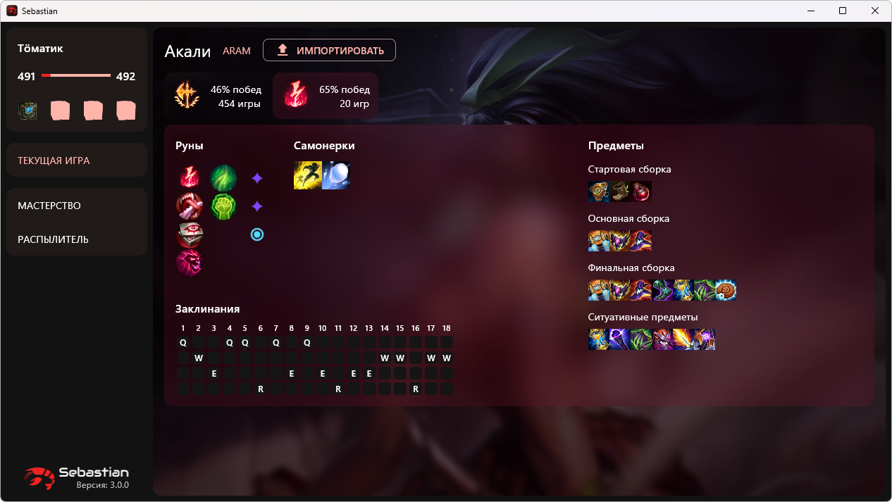
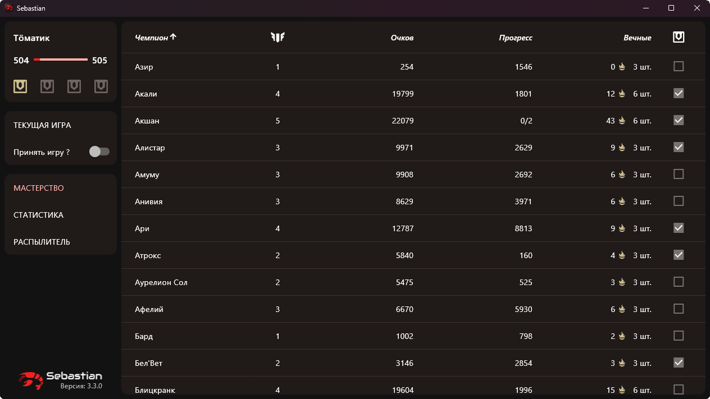
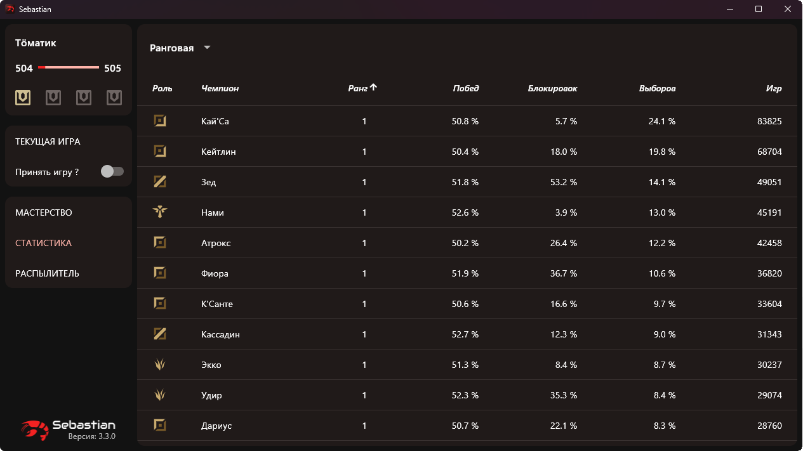
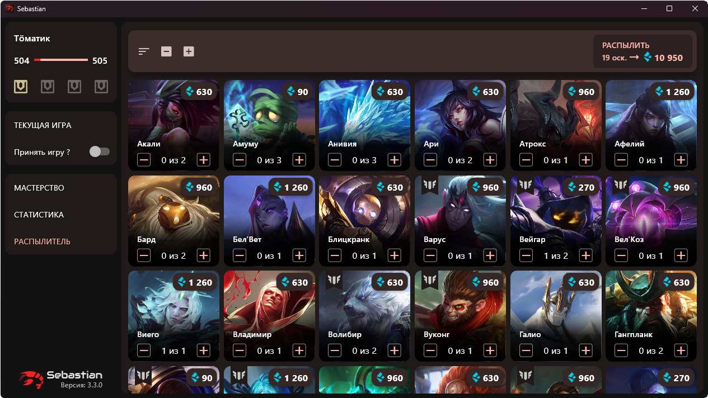

  

## Что может?

* Показывает небольшой профиль призывателя (уровень и доступные сундуки)
* Предлагает и может импортировать сборки на выбранного чемпиона (руны, предметы)
* Показывает информацию по твоим чемпионам (мастерство, доступные сундуки и вечные)
  * во время выбора в ARAM фильтрует таблицу до доступных в лобби чемпионов
* Массово распылять осколки чемпионов
  * показывает метки на осколках, если они могут пригодиться (нет в коллекции или для повышения уровня мастерства)

## Как начать?

### Windows
1. Скачиваем последнюю версию [sebastian-windows.zip](https://github.com/orteney/sebastian/releases/latest)
1. Распаковываем в любое место
1. Запускаем `sebastian.exe`

### MacOS
1. Скачиваем последнюю версию [sebastian-macos.zip](https://github.com/orteney/sebastian/releases/latest)
1. Распаковываем в любое место
1. Запускаем `sebastian.app` (eсли ругается, то попробуй через `правую кнопку мыши -> открыть`)

## Скриншотики

#### Предложенные сборки на выбранного чемпиона

#### Таблица с мастерством чемпионов

#### Таблица с глобальной статистикой чемпионов

#### Распылитель осколков

