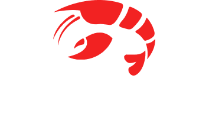

  

## Features

- Always shows the number of Hextech Chests available
- Auto accept matchmaking
- Fast import **Runes** and **Items** from suggested build for selected champion
- Can massively convert selected champion's shards to blue essence
  - auto select unnecessary shards
  - shows a hint if the shard can be useful
- Your champions mastery table (with chest availability and eternal count)
- Global champions stat for current patch
- 🛠️ Technical Features
  - Runs with ~~Electron~~ [Flutter](https://flutter.dev/)
  - All necessary data and assets are loading from running League client
  - Support English and Russian languages

## Installation / Update

### Windows
1. Download latest version [sebastian-windows.zip](https://github.com/orteney/sebastian/releases/latest)
1. Unzip
1. Launch `sebastian.exe`

### MacOS
1. Download latest version [sebastian-macos.zip](https://github.com/orteney/sebastian/releases/latest)
1. Unzip
1. Launch `sebastian.app` (maybe you should bypass Macos Gatekeeper by `right mouse click -> open`)

## Build
1. [Install Flutter](https://docs.flutter.dev/get-started/install)
1. `flutter pub get`
1. `flutter run`

## Credits
- https://github.com/HextechDocs/lcu-explorer
- https://github.com/pipe01/lcu-event-viewer
- https://github.com/CommunityDragon
- https://github.com/elliejs/teemo

## Legal boilerplate
Sebastian is not endorsed by Riot Games and does not reflect the views or opinions of Riot Games or anyone officially involved in producing or managing Riot Games properties. Riot Games and all associated properties are trademarks or registered trademarks of Riot Games, Inc
