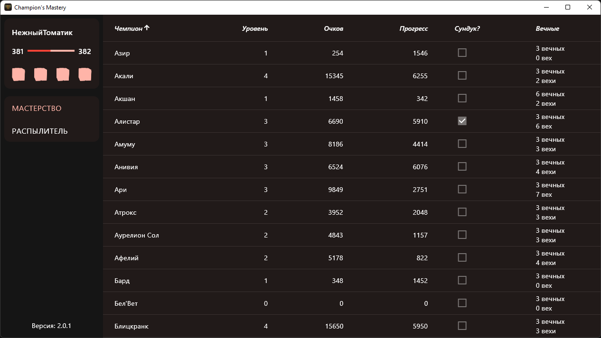
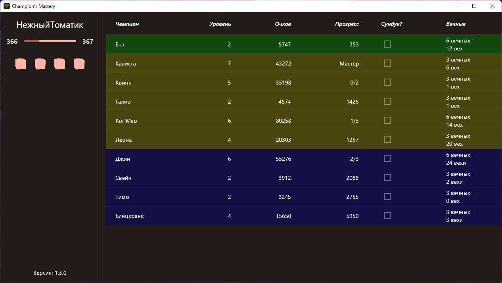

# Champmastery

#### Во время выбора в АРАМ таблица фильтруется до доступных

## Что может?

* Показывает уровень призывателя
* Показывает доступные для получения сундуки
* Показывает информацию по чемпионам (Мастерство, доступность сундука и вечные)
* Распылять выбранные осколки чемпионов

## Как начать?

1. Скачиваем последнюю версию [champmastery.zip](https://github.com/orteney/champmastery/releases/latest)
1. Распаковываем в любое место
1. Запускаем `champmastery.exe`
